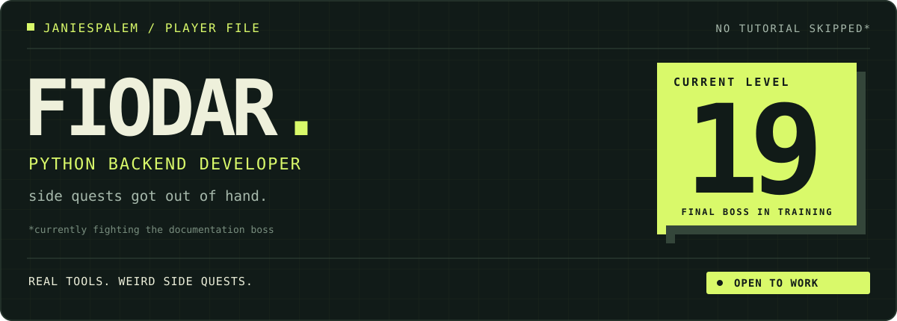

i build **python backends and tools people use at work**. currently developing and supporting internal software for a manufacturing company.

most of it starts with “we do this in Excel.” the side quests are harder to explain.

### main quests

| project | what i built |
| :--- | :--- |
| **[race lens](https://github.com/janiespalem/race-lens)** | motorsport replay and telemetry: timing, tyres, battles, radio. deterministic replay engine, FastAPI + SSE, React, Rust resampling. **[live demo ↗](https://race-lens.onrender.com)** |
| **[factoryflow](https://github.com/janiespalem/rcm-erp-demo)** | a public, synthetic-data demo of manufacturing ERP work: orders → quotes → approvals → production → delivery. FastAPI, SQLAlchemy, Vue. **[screenshots ↗](https://github.com/janiespalem/rcm-erp-demo#product-tour)** |
| **[atomic orbital lab](https://github.com/janiespalem/atom-simulation)** | a C++ / raylib visualizer of hydrogenic orbitals and probability density. wanted to see the maths. ended up sampling 30,000 points. |

also: **[vboard](https://github.com/janiespalem/vboard)** — draw in the air with a webcam. a perfectly reasonable use of a computer.

### co-op mode

contributing to **[couchers.org](https://github.com/Couchers-org/couchers)**. my **[dummy-profile data PR](https://github.com/Couchers-org/couchers/pull/9609)** includes complete seed profiles, sample avatars and tests; updated after maintainer review.

### loadout

**daily:** Python · FastAPI · SQLAlchemy · SQL · Vue · Docker · Linux

**other builds:** PostgreSQL · React / TypeScript · Rust · C++

looking for a **backend / integrations role** with a team i can learn from and contribute to. based in Poland, open to relocation.

**[let's talk on linkedin ↗](https://www.linkedin.com/in/fiodi/)**

---

*boss music sold separately. the code is right here.*
